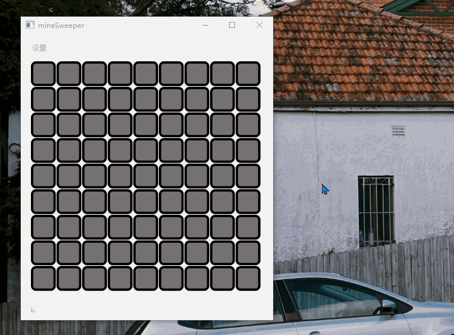

# Qt Mine Sweeper

 A simple implementation of minesweeper using Qt5. 

## Description

This application is a simple imitation of Microsoft's minesweeper, majorly focus on functionality, not UI.

Most of the function was implemented in this application:

+ User-defined minefield
+ Automatic open near blocks of a block if there is no mine near that block
+ High lighting one block if mouse hovers
+ Show how mine scattered around after the game ends

Here is a GIF shows how this application looks like:

 Default difficulty 

## System requirement

+ System: Windows 10
+ Qt version: Qt 5.13.0
+ Compiler: MinGW 7.3.0
